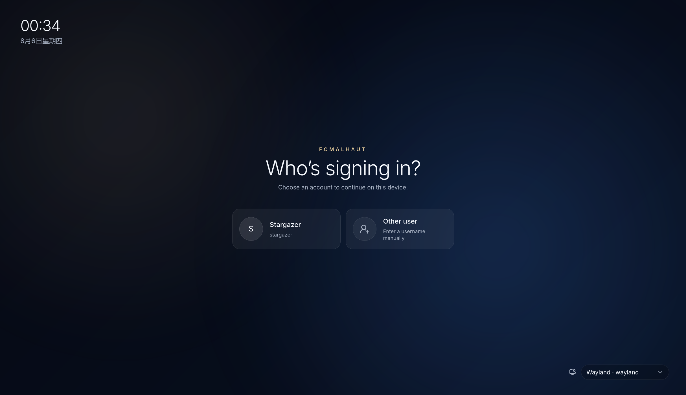
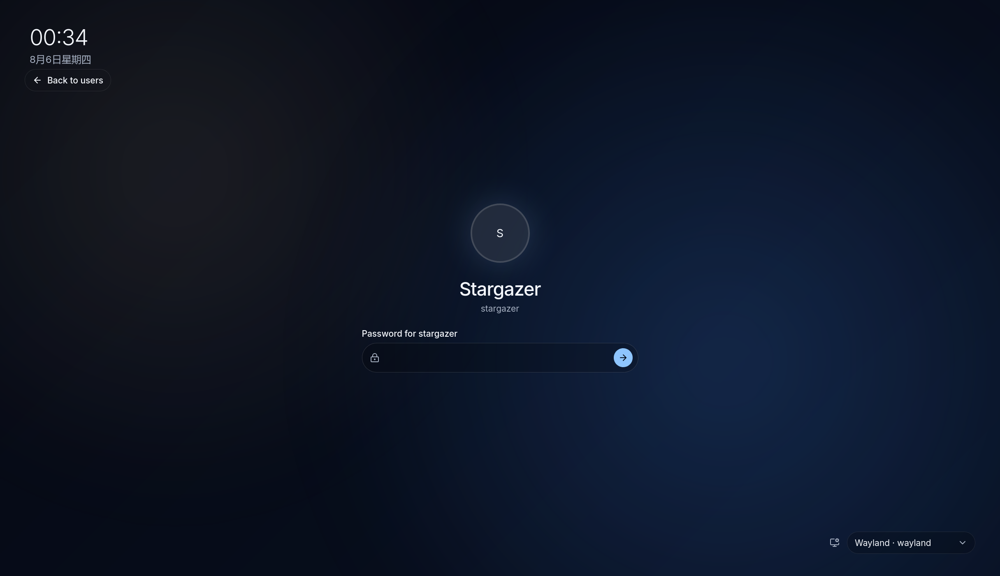

# Fomalhaut

[简体中文](README.zh.md)

Fomalhaut is a local, WebKitGTK-based greetd display manager and Wayland session
locker. It brings fully customizable HTML, CSS, and JavaScript interfaces to
both login and lock screens while keeping login authority in greetd and
current-user reauthentication in an isolated PAM worker.

Fomalhaut is not a web server. Trusted Rust hosts expose a small, versioned,
role-aware protocol to the local theme. Themes never receive the greetd socket,
PAM worker, session-lock handle, session commands, or arbitrary process
execution capabilities.

> [!IMPORTANT]
> Fomalhaut is currently alpha software. The greetd, Cage, and Wayland login
> path has been tested on real systems, but configuration, theme APIs, and
> packaging may still change before the first stable release.

## Preview

| Account selection | Authentication |
| :---: | :---: |
|  |  |

## What it provides

- A polished Nocturne reference theme and a minimal built-in theme.
- Account discovery, avatars, manual username entry, and trusted desktop
  session selection.
- Multi-step PAM conversations, including password, visible, and arbitrary
  follow-up prompts.
- Optional, policy-gated power controls through systemd-logind.
- Fractional display scaling and a theme system that can replace the entire
  login experience.
- An `ext-session-lock-v1` locker with one WebView per output, systemd readiness,
  and fail-closed GTK fallback handling.
- A constrained local WebView with remote resources, arbitrary navigation,
  downloads, pop-ups, and developer tools disabled by default.

Themes can read credentials entered into their own page. Only install themes
from sources you trust and have reviewed.

## Installation

The source installer is the currently supported installation path. It builds
the greeter, locker, and Nocturne theme; installs the PAM policy and systemd
user unit; and updates the Fomalhaut and greetd configuration files.

You will need:

- Linux with greetd, Cage, D-Bus, PAM, GTK 4, gtk4-layer-shell, and WebKitGTK 6.0;
- the latest stable Rust toolchain with Cargo;
- Bun canary and Git; and
- a regular user account with `sudo` access for system installation.

On Arch Linux, the installer can install missing system packages through
`paru`, `yay`, or `pacman`. Rust and Bun must still be installed separately. On
other distributions, install the equivalent build and runtime packages first.

```sh
git clone https://github.com/noctisynth/fomalhaut.git
cd fomalhaut
```

> [!IMPORTANT]
> Set the display scale explicitly during installation. The greeter runs in its
> own Cage session and often needs `1.5` or `2.0` on a HiDPI display, while the
> locker already runs inside the desktop compositor's scaled coordinate space
> and normally uses `1.0`. Pass `--greeter-scale` and `--locker-scale` together,
> or use `--display-scale` when both roles genuinely need the same value. The
> accepted range is `0.5` through `4.0`.

### New installation

Build and install Fomalhaut with the scale appropriate for your display:

```sh
./install.sh --greeter-scale 1.5 --locker-scale 1.0
```

The installer does not enable greetd automatically. From a text console, or
after saving any work in your current graphical session, enable and start it:

```sh
sudo systemctl enable --now greetd.service
```

### Migrating from another display manager

Install Fomalhaut without using `--restart`:

```sh
./install.sh --greeter-scale 1.5 --locker-scale 1.0
```

Save your work and switch to a text console. Check which display manager is in
use, disable and stop that service, and only then enable greetd. For example,
when migrating from SDDM:

```sh
systemctl status display-manager.service
sudo systemctl disable --now sddm.service
sudo systemctl enable --now greetd.service
```

Replace `sddm.service` with the service actually in use, such as `gdm.service`
or `lightdm.service`. Do not leave two display managers enabled at the same
time.

By default, this installs:

- `/usr/local/bin/fomalhaut`
- `/usr/local/bin/fomalhaut-lock`
- `/usr/local/lib/systemd/user/fomalhaut-lock.service`
- `/usr/local/share/doc/fomalhaut-lock/niri.kdl`
- `/usr/local/share/doc/fomalhaut-lock/swayidle.conf`
- `/etc/pam.d/fomalhaut-lock`
- `/etc/fomalhaut/themes/nocturne`
- `/etc/fomalhaut/config.toml`
- `/etc/greetd/config.toml`

The installer does not inspect or change display-manager service enablement.
The `--restart` option is intended only for updates on a system that already
uses greetd; it restarts the service but does not enable it:

```sh
./install.sh --greeter-scale 1.5 --locker-scale 1.0 --restart
```

Use `./install.sh --help` to see shared and per-role scale, cursor size,
greeter account, installation prefix, and staging options. See the
[configuration and installation guide](docs/CONFIGURATION.md) for the complete
setup and upgrade behavior.

## Using Fomalhaut

After greetd starts Fomalhaut, select a discovered account or choose manual
sign-in, select an available desktop session, and answer the prompts supplied
by your system's PAM configuration. Fomalhaut hands the authenticated session
back to greetd and exits once the desktop starts.

System configuration lives at `/etc/fomalhaut/config.toml`. It controls the
theme, display scale, account provider, session search paths, and optional power
actions. The format, greetd/Cage example, and external theme setup are documented
in the [configuration guide](docs/CONFIGURATION.md).

Inside a supported Wayland session, reload the installed user unit and start a
lock with verifiable readiness:

```sh
systemctl --user daemon-reload
systemctl --user start fomalhaut-lock.service
```

The command returns only after the compositor confirms the session lock. The
niri shortcut, compositor-neutral swayidle command, PAM policy, compatibility
limits, and upgrade behavior are in the
[configuration guide](docs/CONFIGURATION.md).

## Workspace

See the [technical design](docs/DESIGN.md) for the workspace layout, component
responsibilities, protocol, and security boundaries.

## Development

See [CONTRIBUTING.md](CONTRIBUTING.md) for the development setup, checks, and
pull request workflow.

## License

Fomalhaut is licensed under the
[GNU Affero General Public License v3.0 only](LICENSE) (`AGPL-3.0-only`).
